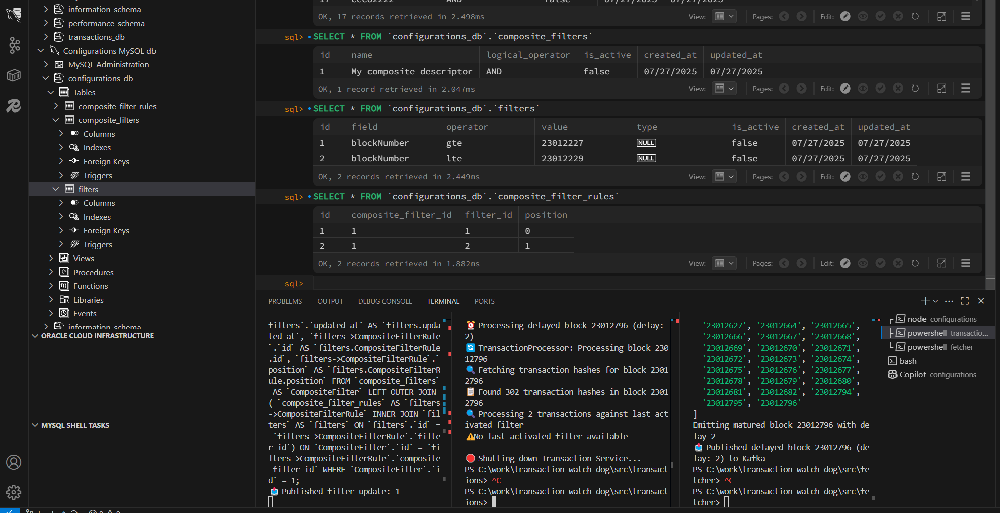
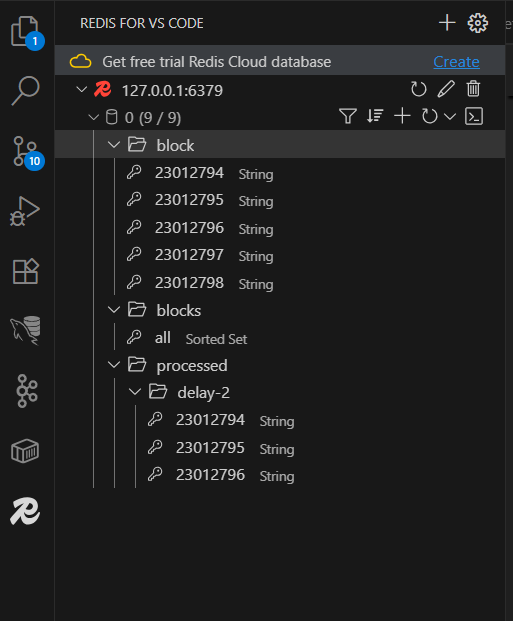
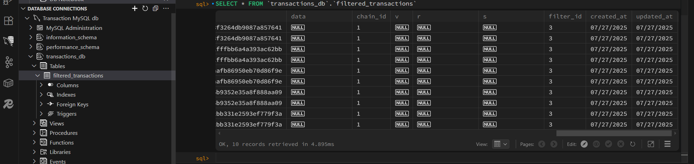

## Walkthrough for Transaction Dog Watcher

After following the steps from the main [README.md](../README.md) and setting up the project, let's walkthrough how to use the application 

1. Set up Postman (and the running the agent for sending requests to localhost). 

The Configurations web service supports several approaches for building filter descriptors:

Send a POST request to /api/filters. It would return an id and confirmation upon successful creation.

```json
{
    "field": "blockNumber",
    "operator": "eq",
    "value": 23012227
}
```

There are two options for creating composite filter descriptors (the endpoint is /api/composite-filters):

```json
{
    "name": "My composite descriptor",
    "logicalOperator": "AND",
    "filters": [
        {
            "field": "blockNumber",
            "operator": "gte",
            "value": 23012227
        },
        {
            "field": "blockNumber",
            "operator": "lte",
            "value": 23012229
        }
    ]
}
```

However, if you have created several simple filters, just pass their IDs instead. 

```json
{
    "name": "My other composite descriptor",
    "logicalOperator": "OR",
    "filters": [12, 19]
}
```

Here's an example of the database configurations after creating filters. I am using a junction table, because one composite filter can have multiple filters. Also, the filter is automatically published on Kafka.



To activate the filter (if you did not set `is_active: true` in the body above), use the dedicated endpoints:

- `PUT /api/filters/:id/activate`
- `PUT /api/filters/:id/deactivate`
- `PUT /api/composite-filters/:id/activate`
- `PUT /api/composite-filters/:id/deactivate`

Any changes to the filter descriptors is automatically posted on Kafka and consumed by the Transactions microservice.

2. The fetcher service fetches new blocks through the dedicated WebSocket endpoint exposed by Infura. It stashes them in Redis,
so that we can control the mature period before posting to Kafka for consumption from the Transactions microservice. 



When a matured block is posted and we have an active filter from the configurations, the transactions microservice comes into play. 

3. The Transactions microservice keeps track for every transaction that has passed the filter implied by the configurations service. 

If there is such a match, we save it in MySQL db. 

Please, pay close attention to the two testing flags: 

[Batch limiting](https://github.com/CecoMilchev/transaction-watch-dog/blob/43737e4e6236682c391dc4e1106c29cf21b54881/src/transactions/src/services/transactionDetailsFetcher.js#L7)
[Batch count limiting](https://github.com/CecoMilchev/transaction-watch-dog/blob/43737e4e6236682c391dc4e1106c29cf21b54881/src/transactions/src/services/transactionDetailsFetcher.js#L35)


